# How to build an end-to-end Machine Learning pipeline using AWS Glue, Amazon S3, Amazon SageMaker and Amazon Athena.

In this workshop, we will build an end-to-end pipeline to predict the accessibility of playgrounds in NYC based on borough, and tax income information. Our pipeline will combine several different data sources, use AWS Glue for serverless extract-transform-load (ETL) jobs, Amazon SageMaker for Machine learning, Amazon Simple Storage Service (S3) for storage and staging the datasets, and Amazon Athena to make inferences from the trained machine learning model directly using SQL functions.

In addition to training ML models using existing SageMaker functionality, you will learn how to use SageMaker APIs to launch an AutoPilot job from a Jupyter environment, which allows you to automatically build, train and tune ML models. 

By the end of this lab, your data scientists and analysts will learn how to directly obtain predictions from ML models using just SQL queries. The inferences can directly then be ingested into a database for OLAP or business intelligence. 

The end-to-end architecture we will build in this lab is the following:

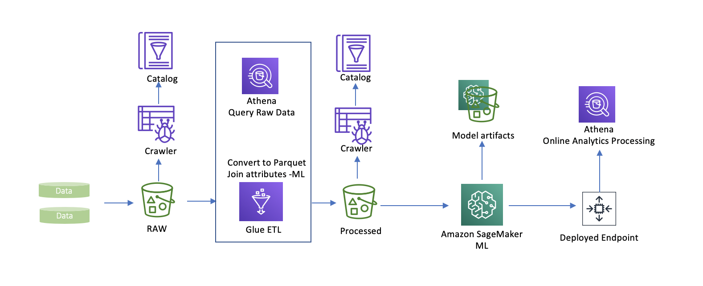

Table of Contents
=================

[Create S3 buckets 3](#create-s3-buckets)

[Create Glue job for extracting and storing raw data
4](#create-glue-job-for-extracting-and-storing-raw-data)

[Catalog RAW data. 6](#catalog-raw-data.)

[Analyze Raw Data using Athena 9](#analyze-raw-data-using-athena)

[Create Glue Job to join income, parks, playground data
10](#_Toc24374324)

[Automate the data processing pipeline using Glue Workflow(Optional)
12](#automate-the-data-processing-pipeline-using-glue-workflowoptional)

[Conclusion 14](#conclusion)

[Appendix 15](#appendix)

Create S3 buckets
=================

1.  Please use Chrome or Firefox browser to ensure smooth lab experience.

2.  Sign into the AWS Management Console

3.  Click on **S3** from the list of all services. This will bring you to the S3 dashboard page.

4.  On the S3 Dashboard, create two buckets for storing **Raw** and **Processed** data as follows:

    1.  Click on **Create bucket** and then enter Bucket name:
        **\<\<USERID\>\>-raw** and click on Create. Create another
        bucket for storing processed
        objects **\<\<USERID\>\>-processed**


        
        
Create Glue job for extracting and storing raw data
===================================================

In this section, we will be creating two glue jobs:

a.  Import\_income\_data: To extract 2016 income data for all 50 dates
    in CSV format

b.  Import\_json\_data: To extract parks and playgrounds data in JSON
    format.

1.  Sign into the AWS Management Console
    <https://console.aws.amazon.com/>.

2.  Click on **AWS Glue** from the list of all services. This will bring
    you to the Amazon Glue dashboard page.

3.  On the Glue Dashboard, click **Jobs** on the left panel and then
    click **Add Job**
    
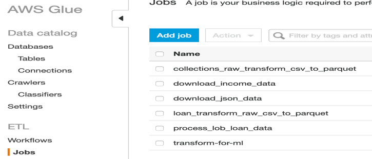

4.  Enter the following information:

    -   Name: import\_income\_data

    -   IAM Role: userid\_glue\_s3(refer to Appendix for creating this
        role)

    -   This job runs: A new script to be authored by you.

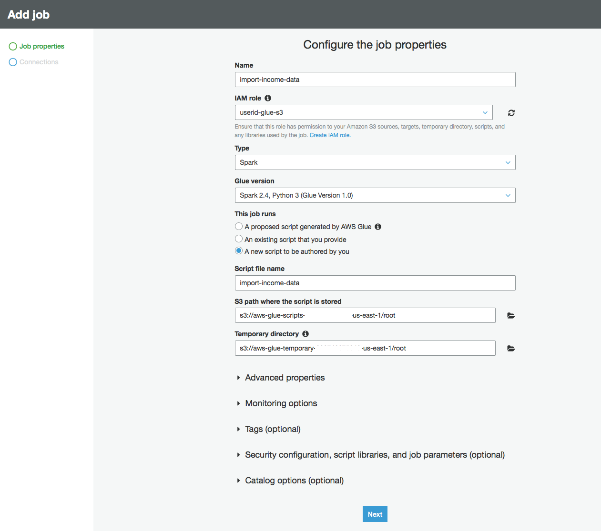

5.  Click **Next** in the lower-right corner of the screen.

6.  Click Save job and edit script

7.  Paste the following source code: Replace \<\<userid\>-raw with
    the RAW bucket you created in Create S3 buckets section.

The python code below, downloads income data in CSV format from the
provided income\_url and writes it to s3 using boto3.

https://github.com/aws-samples/amazon-sagemaker-predict-accessibility/blob/master/src/download_income.py

8.  Click on Save and Run Job


9.  Repeat steps 1-8 to create a job to import parks and playgrounds
    data in json format.

    -   Name: import\_json\_data

    -   IAM Role: userid\_glue\_s3(refer to Appendix for creating this
        role)

    -   This job runs: A new script to be authored by you.

    -   Replace **\<\<userid\>\>-raw with your userid in the source
        code below**

The python code below, downloads parks & playground data in JSON format
from the provided parks\_url & playgrounds\_url and writes it to S3 in
parquet format.


https://github.com/aws-samples/amazon-sagemaker-predict-accessibility/blob/master/src/download_json.py

1.  Sign into the AWS Management Console
    <https://console.aws.amazon.com/>.

2.  Click on **AWS Glue** from the list of all services. This will bring
    you to the Amazon Glue dashboard page.

3.  On the Glue Dashboard, click **Crawlers** on the left panel and then
    click **Add Crawler**

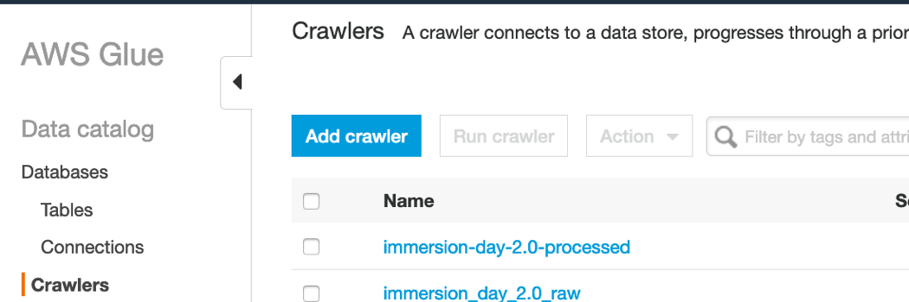

> Enter the following crawler information:

-   Name: **crawl\_raw\_data**

-   Crawler Source Type: Data stores

-   Choose Data Store: S3

-   Crawl data in: Specified path in my account

-   Include Path: \<\<userid\>\>-raw

-   Add another datastore: No

-   Choose an existing IAM role and select \<\<userid\>\>\_glue\_s3

-   Frequency: Run on demand

-   Configure Crawler's output

    1.  Add database and enter \<\<userid\>\>-raw as database name
        > and click Create

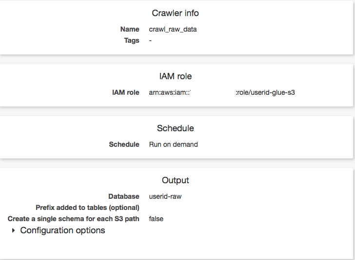

4.  Click **Finish and Run Crawler**

5.  On the left panel, click on **Databases** and select
    \<\<userid\>\>-raw and click on Tables in
    \<\<userid\>\>-raw.


6.  Click on one of the tables (parks) to view its schema and
    partitions.


Analyze Raw Data using Athena
=============================

1.  Sign into the AWS Management Console
    <https://console.aws.amazon.com/>.

2.  Click on **Athena** from the list of all services. This will bring
    you to the Amazon Athena dashboard page.

3.  Select **\<\<userid\>\>-raw** from database list and any of the
    three tables(parks). Clicking on preview table will generate the
    sample select query. Use Athena to analyze other tables using ANSI
    SQL syntax.

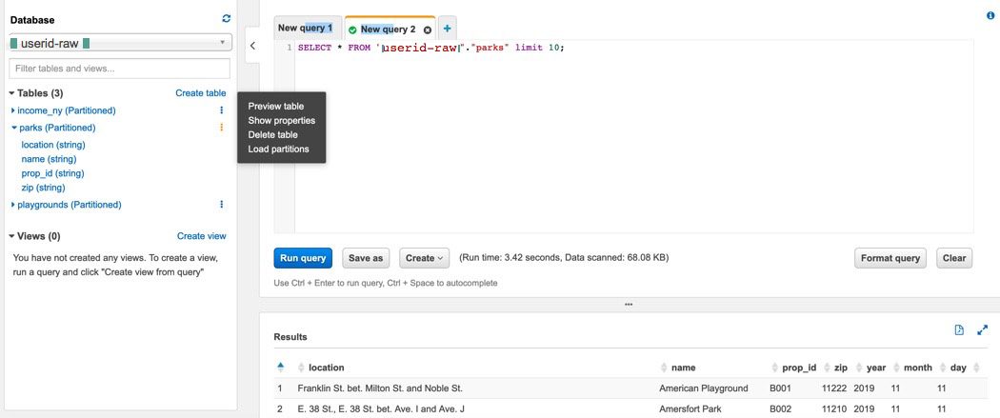

Create Glue Job to join income, parks, playground data
======================================================

In this section we will create a glue job to combine the income, parks,
playgrounds data into one for ML processing.

-   Name: prep\_data\_for\_ml

-   IAM Role: userid\_glue\_s3(refer to Appendix for creating this role)

-   This job runs: A new script to be authored by you.

-   Replace **\<\<userid\>\>-raw with your userid in the source code
    below**

> The python code does the following:

1.  Load parks, playground, income data from the glue catalog as dynamic
    frame

2.  Filter income data for NY and include/rename fields required for
    analysis

3.  Join parks and income data using Zipcode

4.  Left outer join playgrounds and combined parks\_income data using
    Prop ID.

5.  Write combined playgrounds, parks, income data to
    \<\<userid\>\>-processed bucket
    
 
https://github.com/aws-samples/amazon-sagemaker-predict-accessibility/blob/master/src/transform_for_ml.py

11. Click on Save and Run Job

12. Create a crawler to catalog and analyze process data as follows:

> From the Glue dashboard, click on **Crawlers** and **Add Crawler** and
> enter the following crawler information:

-   Name: **crawl\_processed\_data**

-   Crawler Source Type: Data stores

-   Choose Data Store: S3

-   Crawl data in: Specified path in my account

-   Include Path: \<\<userid\>\>-processed

-   Add another datastore: No

-   Choose an existing IAM role and select \<\<userid\>\>\_glue\_s3

-   Frequency: Run on demand

-   Configure Crawler's output

    1.  Add database and enter \<\<userid\>\>-processed as database
        > name and click Create

7.  Click **Finish and Run Crawler**

You can analyze this processed data using Athena and SQL as described in
prior section: "Analyze raw data using Athena"

Automate the data processing pipeline using Glue Workflow(Optional)
===================================================================

1.  Sign into the AWS Management Console
    <https://console.aws.amazon.com/>.

2.  Click on **Glue** from the list of all services. This will bring you
    to the Amazon Glue dashboard page.

3.  Click on Workflow and add Workflow

4.  Workflow name: playgrounds\_workflow\_for\_ml

5.  Add trigger to start processing workflow on demand


6.  Add jobs import\_json\_data and import\_income\_data to start
    trigger

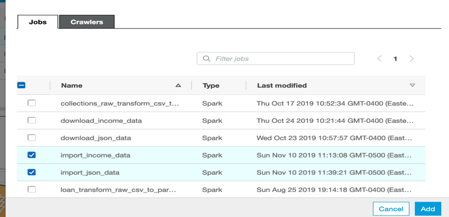

7.  Add trigger to watch the above jobs and to trigger
    raw\_data\_crawler

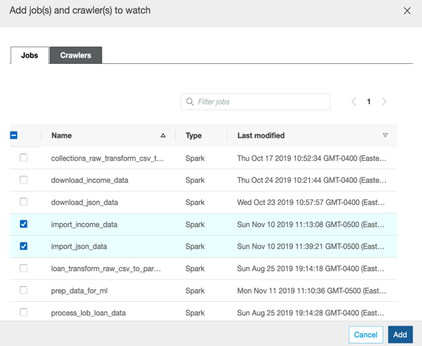


8.  Complete the workflow following the above steps

    a.  Add trigger to watch crawl\_raw\_data and trigger new event
        process\_data\_for\_ml job

    b.  Add trigger to watch process\_data\_for\_ml and trigger
        crawl\_processed\_data

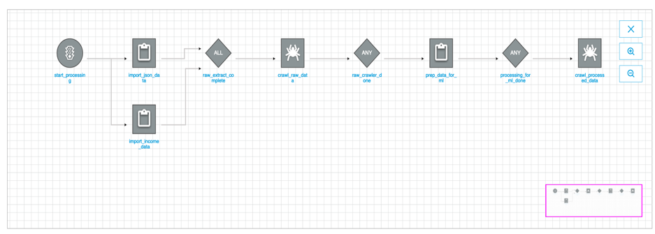

9.  Run workflow, click on History and selct the running job to monitor
    progress


## Machine Learning

Next navigate to the s3 bucket where your parquet file is created (<<userid>>-processed bucket) and download the file locally on your computer.
    
**Note: For ML Immersion Labs, you don't need to complete this next part. Simply upload the parquet file you downloaded to your SageMaker notebook environment and run through the rest of the lab from the notebook**
    
In the AWS console, search and find Amazon SageMaker, and click Create Notebook Instance. <br/>
Give the notebook instance a name such as sagemaker-<<userid>>-notebook or any name of your choice which matches the required naming convention. <br/>
Leave the defaults for instance type <br/>
In **Permissions and Encryption**, choose *Create a new role* and enter the name of your S3 bucket (<<userid>>-processed bucket). This ensures that SageMaker has access to this bucket for storing model artifacts and processed features. <br/>
Click Create Role and Create Notebook Instance.
    
Once the notebook instance is created, click on Open Jupyter. Download the "Predict_accessibility_using_ML.ipynb" notebook on your local computer. 
Click Upload in the Jupyter console and upload both the parquet file and the ipynb to Jupyter. 

Once uploaded, follow the steps in the Predict_accessibility_using_ML.ipynb Notebook to complete the rest of the lab.
**Remember**: replace the bucket name with your bucket <<userid>>-processed bucket, and filename with the name of your parquet file.  

**Remember**: Do not delete your SageMaker endpoints until you complete the Athena portion below. If you delete them by accident, simply recreate the SageMaker endpoint by re-running the code cell shown below

```python
xgb_predictor = xgb.deploy(initial_instance_count=1,
                                 instance_type='ml.m4.xlarge')
```
 
Once your endpoints are up and running, we will run some inferences using Amazon Athena. 

## Inferences using Amazon Athena

As of 2019 Re:Invent, AWS introduced a new feature whereby analysts and data scientists can directly query their machine learning models using SQL without having to write any custom python code. This enables data scientists and analysts to directly ingest predictions from their ML models into a database of their choice, run SQL queries for further analytics and business intelligence.

Here we will show how this works.

Since this is a new feature, as of this Github repo, the feature is still in **Preview**. This requires one additional stepsin order to get it to work.

Navigate to the Amazon Athena console. <br/>
Click Connect to Data Source and Choose S3 and AWS Glue for the Data Catalog. <br/>
Select Set up crawler in AWS Glue ... and click on **Connect to AWS Glue**. <br/>

This will open a separate page for AWS Glue. Enter a name for your crawler, choose data stores, keep the default to S3 and 
using the folder icon, navigate to the *folder* containing the train.csv file in your bucket. 

**Caution**: it is very important to not enter the full path ending in /train.csv, but rather only up to the folder containing the train.csv file. If you do the former, your Athena queries won't return any results. Make sure to put a "/" after the folder name containing the train.csv file.

Click Next, Next and Create an IAM role. Click Next <br/>
Set Frequency to run on demand <br/>
For database, choose the database name you chose above <<userid>>-raw, Click Next and Finish. 
    
Run the crawler. 

Once the crawler has successfully completed, navigate to the Athena Query Editor. You should find a "train" table created containing columns col0 ... col12.

**Important**
While the ML feature is still in preview, you need this additiona step:

Click on Workgroup <br/>
Create Workgroup <br/>
For workgroup name, Enter: AmazonAthenaPreviewFunctionality <br/>
For Query Result Location, use the folder icon to navigate to the <<user-id>>-processed bucket to store your query artifacts. <br/>
Click Create Workgroup <br/>

Once the Workgroup is created, ensure that this workgroup is selected, and click Switch Workgroup.

Remember that the XGBoost algorithm requires that all headers are removed before saving the train.csv file, so Glue assigns column names to the columms. Also notice that col0 is the actual labels.

We will now call our SageMaker endpoint and test our predictions on the training data. 

In the SageMaker console, navigate to Endpoints, and copy the name of the endpoint you just created for your standalone XGBoost model (not AutoPilot) to the clipboard. It should look something like this: **sagemaker-xgboost-####**

To do so, in the Query editor, write the following query, but replace where it says :
```sql
sagemaker_endpoint = 'your endpoint here': 
```
with your endpoint name and replace "sampledb" in below 

```sql
FROM sampledb.train
```

with the name of your database. 

```sql
USING FUNCTION predict(col1 double, col2 double, col3 double, col4 double, col5 double,
                       col6 double, col7 bigint, col8 bigint, col9 bigint, col10 bigint, col11 bigint, col12 bigint) 
                       returns double type SAGEMAKER_INVOKE_ENDPOINT
WITH (sagemaker_endpoint='sagemaker-xgboost-2019-12-23-19-06-32-813')

SELECT ROUND(predict(col1, col2, col3, col4, col5, col6, col7, col8, col9, col10, col11, col12)) AS PREDICTED, col0 AS ACTUAL
FROM 
    (SELECT *
FROM sampledb.train)
```

It should look like this:
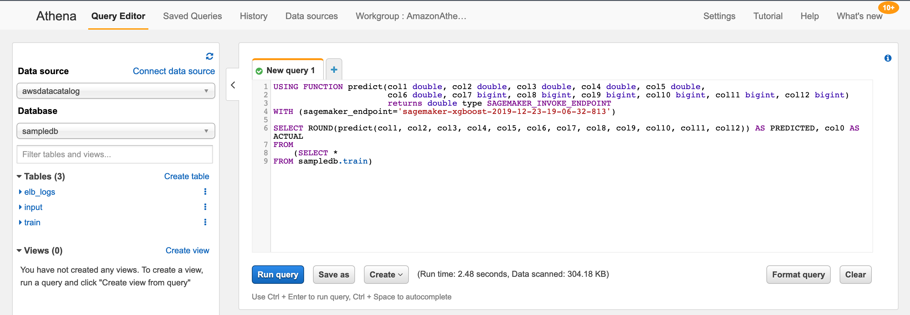

Click Run.

Once the query is run, the final output should look something like this:

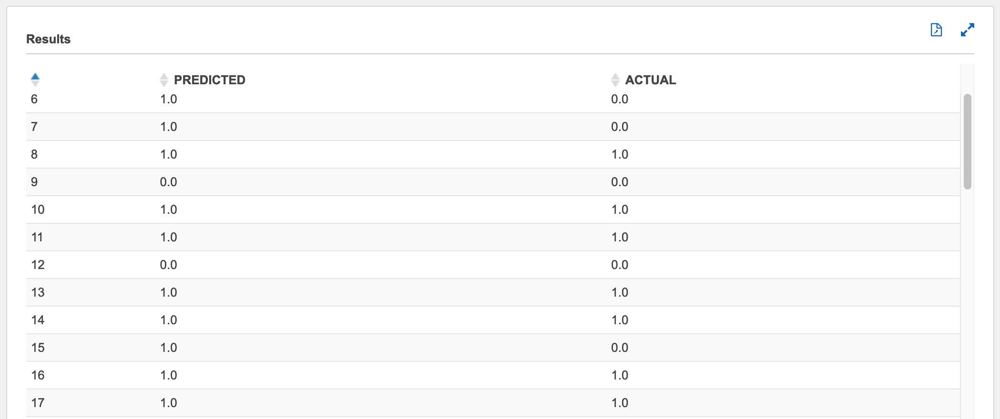

and that's it!

You now have produced inferences using your ML model using Amazon Athena using data in S3, without a single line of python code!


Conclusion
==========

In this lab you have learned how to leverage AWS glue to collect data
from different sources, store the raw data on S3 and process and save
the result on S3. You analyzed raw and processed data using Athena and
also automated the data processing pipeline using Glow workflow. 

Following this, you trained used Amazon SageMaker to ingest the parquet files from Glue,
perform some data exploration and feature engineering and stage the processed features into an S3 bucket. You then trained an ML model using Amazon SageMaker's built in algorithms as well as SageMaker AutoPilot which automates a lot of the feature engineering tasks common in a data science workflow. 

Finally once a trained model was generated, you deployed the model in Amazon SageMaker and performed inferences against that model using Amazon Athena with minimal code. This allows analysts to directly benefit from trained machine learning model using just SQL code. 


Appendix
========

**Create a Role for Glue to have proper permissions**

1.  Sign into the AWS Management Console
    <https://console.aws.amazon.com/>.

2.  Click on **IAM** from the list of all services. This will bring you
    to the IAM dashboard page.

3.  Click **Roles** on the left hand panel and then click **Create
    role**

4.  Select **Glue**

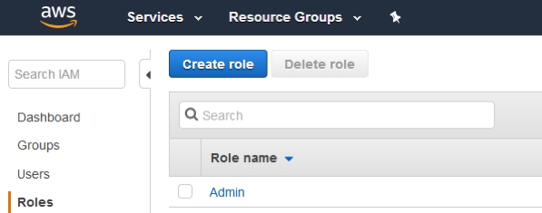

5.  Click **Next: Permissions.**

6.  In attach permission policies page, search for Glue and select
    **AWSGlueServiceRole**

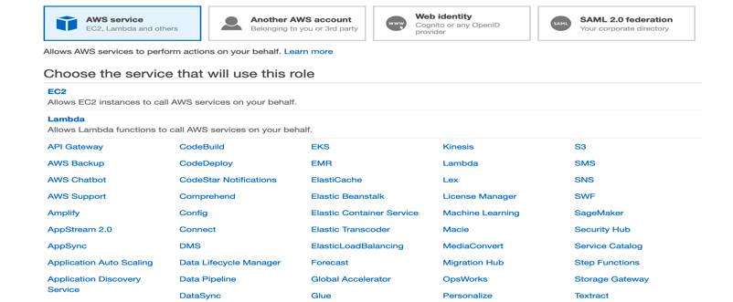

7.  Search for S3 and select AmazonS3FullAccess.

8.  Click **Next: Tags** and **Next: Review**

9.  Enter **Userid\_glue\_s3** for the Role Name and click **Create
    Role**
    
    
   # License Summary
   
   This sample code is made available under a modified MIT-0 license. See the LICENSE file.
